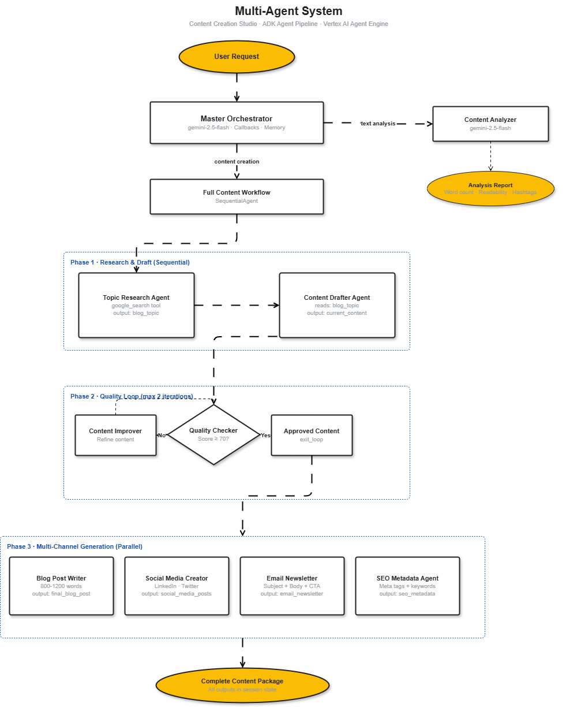
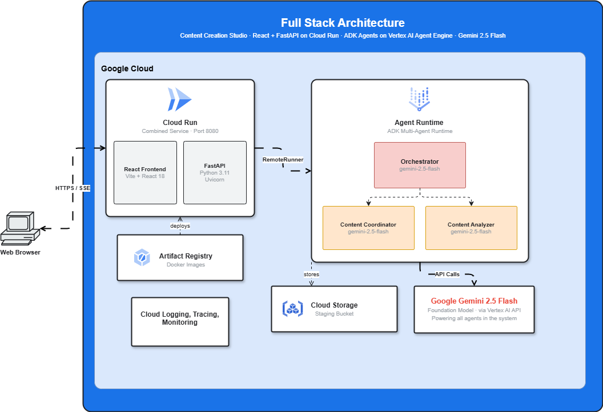

# Content Creation Studio

Content Creation Studio is a full-stack AI application powered by:

- Google ADK (Agent Development Kit) for orchestrating a multi-agent pipeline.
- Gemini 2.5 Flash as the foundation model across the agents.
- Gemini Enterprise Agent Runtime, formerly Vertex AI Agent Engine, for managed agent deployment.
- FastAPI and React served from a single Cloud Run container.

This is not a chatbot demo. It is a real web application backed by a team of
collaborating AI agents that produce a complete content package from one topic
request.

After deployment, Cloud Run prints the public service URL for the app.

## What You Build

You build two layers of the same application.

### Layer 1 - The Agent Pipeline

A team of specialized ADK agents collaborate to produce a complete content
package from a single topic request.

The pipeline combines:

- A master orchestrator that routes content creation and text analysis requests.
- A sequential research and drafting workflow.
- An iterative quality loop that improves content until it passes checks.
- Parallel channel generation for blog, social, email, and SEO outputs.
- A content analyzer path for standalone text analysis.



### Layer 2 - The Full-Stack App

A React frontend and FastAPI backend are deployed as a single Cloud Run service.
The backend connects to the agents running on Agent Runtime and streams progress
and generated content to the browser with Server-Sent Events.



## What You Learn

### ADK Core Concepts

- The ADK runtime: Runner, Session, SessionService, and the event model.
- How session state flows between agents with `output_key` and `{key}` templating.
- How callbacks can add observability and content safety guardrails.
- How artifacts can provide persistent file storage across sessions.
- How long-term memory can survive session boundaries.

### Multi-Agent Design With ADK

- When to use LLM-driven versus workflow-driven architectures.
- How to chain agents with `SequentialAgent`.
- How to build iterative quality loops with `LoopAgent` and `exit_loop`.
- How to run tasks concurrently with `ParallelAgent`.
- Coordination patterns such as `AgentTool` and `sub_agents`.

### Deployment

- Deploy ADK agents to Gemini Enterprise Agent Runtime.
- Package a React and FastAPI app into a single Docker container.
- Build the container in Cloud Build and store it in Artifact Registry.
- Deploy the app to Cloud Run.
- Connect the frontend/backend service to the remote agent runtime.

## Google Cloud Architecture

- **Gemini Enterprise Agent Runtime / Vertex AI Agent Engine** runs the ADK
  orchestrator and specialist agents.
- **Cloud Run** serves the bundled FastAPI backend and React frontend from one
  container.
- **Artifact Registry** stores the Cloud Run container image.
- **Cloud Build** builds the production image in GCP.
- **Cloud Storage** is used as the Agent Runtime staging bucket.
- **Cloud Logging, Trace, and Monitoring** receive runtime observability data.

## Prerequisites

- A Google Cloud project with billing enabled.
- Google Cloud CLI installed and authenticated.
- Basic Python familiarity with functions, classes, and `async` / `await`.
- No frontend experience required; the React app is included.

## Deploy To GCP

1. Copy the environment template:

   ```bash
   cp .env.example .env
   ```

2. Fill in at least:

   ```bash
   GOOGLE_CLOUD_PROJECT=your-project-id
   GOOGLE_CLOUD_LOCATION=us-central1
   GOOGLE_CLOUD_STORAGE_BUCKET=gs://your-project-id-content-studio
   ```

3. Authenticate locally:

   ```bash
   gcloud auth login
   gcloud auth application-default login
   ```

4. Run the full deployment from Windows PowerShell:

   ```powershell
   .\deployment\deploy-gcp.ps1 -AutoApprove
   ```

   Or from Cloud Shell, Linux, or macOS:

   ```bash
   bash deployment/deploy-gcp.sh
   ```

The full deploy script prepares GCP resources, deploys the ADK agent to Agent
Runtime if `AGENT_ENGINE_RESOURCE_NAME` is empty, then deploys the combined
frontend/backend service to Cloud Run.

## Update An Existing Deployment

After the first deployment, when `AGENT_ENGINE_RESOURCE_NAME` already exists in
`.env`, update only the Cloud Run app:

```powershell
.\deployment\deploy-combined.ps1 -AutoApprove
```

Or from Cloud Shell, Linux, or macOS:

```bash
AUTO_APPROVE=true bash deployment/deploy-combined.sh
```

## Clean Up Resources

To avoid ongoing cloud costs, remove the deployed resources when you are done:

```powershell
gcloud run services delete content-studio --region us-central1 --project your-project-id --quiet
gcloud artifacts repositories delete content-studio --location us-central1 --project your-project-id --quiet
gcloud storage rm --recursive gs://your-project-id-content-studio --quiet
```

If you deployed an Agent Runtime, delete the `AGENT_ENGINE_RESOURCE_NAME`
resource from Vertex AI Agent Engine, then clear it from `.env`.

## Local Checks

```bash
python -m compileall -q agents backend common
cd frontend && npm ci && npm run build
```

## Secret Handling

`.env` is intentionally ignored by both Git and Docker build context. Keep real
project IDs, resource names, and credentials in `.env`; commit only
`.env.example`.
